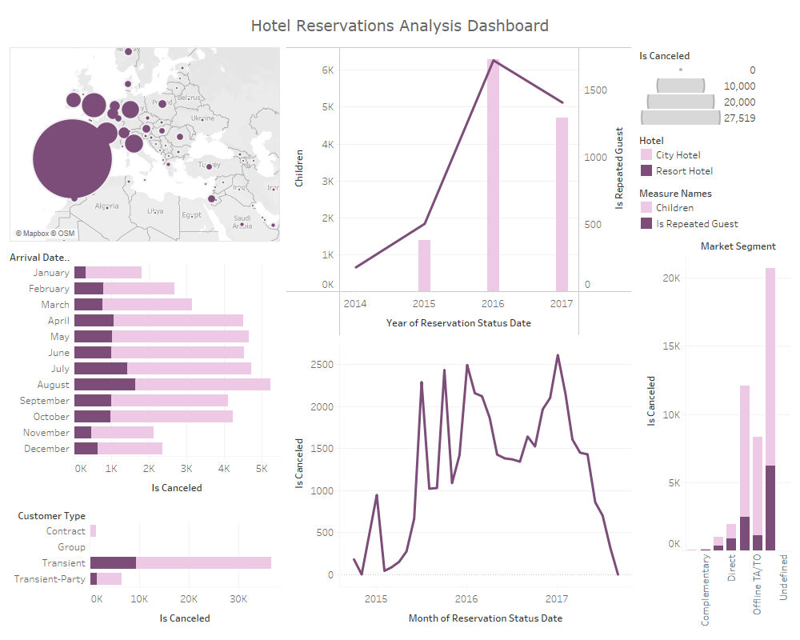

# Hotel-Reservation-Analysis-in-SQL-and-Tableau

For this project, I made use of Google BigQuery and Tableau to analyse hotel reservations made.

## SQL Queries

1. Total Cancellations made over the year
    
   
   

2. Countries with the most cancellations   

3. Variation between cancellation rate and the presence of minors   

4. Percentage of Cancelled Reservations   

5. How does the type of deposit made affect cancellation rate?   

6. Hotels with the most cancellations   

 
## Tableau Dashboard
 

